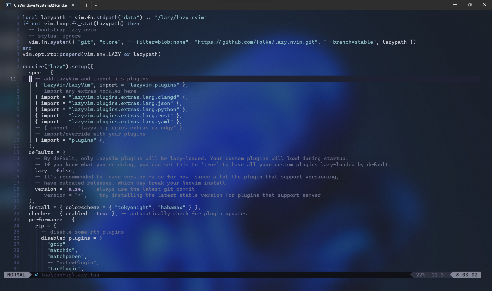

# 💤 LazyVim

A starter template for [LazyVim](https://github.com/LazyVim/LazyVim).
Refer to the [documentation](https://lazyvim.github.io/installation) to get started.

## Screen shot



## Install

```sh
git clone https://github.com/Namacha411/lazy-vim-config.git $env:LOCALAPPDATA/nvim
```
